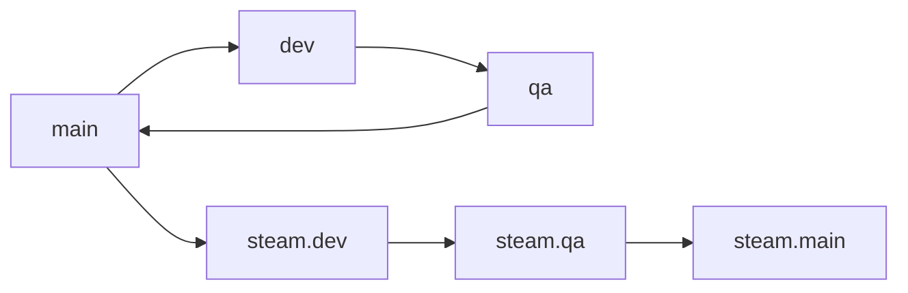

# Contributing

This repository uses two parallel branch lines:

- `main` for the stable product
- `dev` for everyday development
- `qa` for validation before merging back to `main`
- `steam.main` for the Steam-oriented release line
- `steam.dev` for Steam feature development
- `steam.qa` for Steam verification before merging to `steam.main`

## Branch flow

## Working rules

- Develop day-to-day features on `dev`
- Keep release testing on `qa`
- Merge to `main` only after `qa` passes
- Keep Steam-specific work on `steam.dev`
- Validate Steam changes on `steam.qa`
- Merge to `steam.main` only after Steam QA passes
- Avoid direct commits to `main` and `steam.main`

## Suggested workflow

1. Create a short-lived feature branch from `dev` or `steam.dev`
2. Open a PR back into the same development line
3. Promote the tested branch into `qa` or `steam.qa`
4. Merge the release branch into `main` or `steam.main`
5. If a fix is shared, backport it to the matching development line

## Notes for this project

- `dev` stays close to the knowledge-graph product
- `steam.dev` can diverge into a more game-like UI and interaction model
- Shared core logic should be merged or cherry-picked deliberately so the two lines do not drift accidentally
