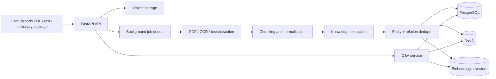

# Backend Architecture

This project is designed as a web-first product with a dedicated FastAPI backend that handles ingestion, extraction, retrieval, and question answering.

## Recommended stack

- API layer: `FastAPI`
- Background jobs: `Celery` or `RQ` with `Redis`
- Relational store: `PostgreSQL`
- Graph store: `Neo4j`
- Object store: `S3` compatible storage for uploads and derived artifacts
- Search: `PostgreSQL full-text` for baseline, later `OpenSearch` if needed
- Embeddings: a vector field in `PostgreSQL` (`pgvector`) or a separate vector DB if scale requires it

## High-level flow



## Service boundaries

### `API gateway`

Responsibilities:

- Authentication and authorization
- File upload and document registration
- Graph query endpoints
- Q&A endpoint
- Job status polling

### `Ingestion pipeline`

Responsibilities:

- Detect file type
- Extract text from PDF, EPUB, DOCX, TXT, or packaged dictionary data
- OCR scanned pages when text is missing
- Split into sections, paragraphs, and candidate concepts
- Normalize aliases, duplicates, and cross-book canonical names

### `Knowledge extraction`

Responsibilities:

- Find candidate entities, terms, topics, and processes
- Classify relations such as `is-a`, `part-of`, `depends-on`, `contrast-with`, and `same-domain`
- Attach provenance back to source pages or paragraphs
- Assign confidence scores

### `Graph storage`

Use both stores intentionally:

- `PostgreSQL` stores documents, chunks, aliases, provenance, job state, and permissions
- `Neo4j` stores traversal-friendly concept and relation graphs

That split gives you:

- Strong transactional metadata handling
- Fast graph traversal and neighborhood expansion
- Easier multi-book merging and source tracing

### `Q&A service`

Use a hybrid retrieval strategy:

1. Expand from the query into candidate concepts with BM25 / lexical search
2. Pull local graph neighborhood from Neo4j
3. Rank by semantic similarity using embeddings
4. Generate the final answer with citations and page references

## Suggested domain model

### Documents

- `id`
- `title`
- `source_type`
- `language`
- `imported_at`
- `status`
- `metadata`

### Chunks

- `id`
- `document_id`
- `page_number`
- `section_path`
- `text`
- `embedding`
- `hash`

### Concepts

- `id`
- `canonical_name`
- `category`
- `definition`
- `aliases`
- `confidence`

### Relations

- `id`
- `source_concept_id`
- `target_concept_id`
- `relation_type`
- `confidence`
- `evidence_chunk_ids`

### QA traces

- `id`
- `question`
- `answer`
- `retrieved_concept_ids`
- `citation_chunk_ids`
- `model_version`

## API sketch

### Ingestion

- `POST /v1/documents`
- `POST /v1/documents/{id}/upload`
- `POST /v1/documents/{id}/process`
- `GET /v1/jobs/{job_id}`

### Graph

- `GET /v1/graphs/{graph_id}`
- `GET /v1/nodes/{node_id}`
- `GET /v1/nodes/{node_id}/neighborhood`
- `GET /v1/search?q=...`

### Q&A

- `POST /v1/qa`
- `POST /v1/qa/stream`

Example Q&A request:

```json
{
  "question": "What is collocation and how does it differ from synonym?",
  "graph_id": "default",
  "context_node_id": "node_123",
  "top_k": 8
}
```

## Multi-book merging strategy

When multiple books cover the same domain:

1. Canonicalize aliases and dictionary headwords
2. Merge exact duplicates by normalized label
3. Merge near-duplicates by similarity threshold plus human override
4. Preserve source provenance for every merged concept
5. Let conflicting definitions coexist until a confidence rule or review step resolves them

This is important for language learning and technical subjects where different books often define the same term in slightly different ways.

## PDF parsing pipeline

1. Store the original file
2. Extract text layer if available
3. Fall back to OCR for scanned pages
4. Detect headings, paragraphs, lists, tables, and glossary entries
5. Build page-level and section-level chunks
6. Run entity and relation extraction
7. Create provenance records back to page and paragraph offsets

## Q&A quality plan

- Always attach citations
- Prefer graph-supported answers over generic generation
- Show uncertainty when evidence is weak
- Use source-aware prompting so the model sees only the most relevant chunks
- Cache results for repeated questions

## Delivery phases

### Phase 1

- Upload documents
- Extract text
- Build graph
- Search and open nodes

### Phase 2

- PDF OCR fallback
- Multi-book dedupe
- Citation-aware Q&A

### Phase 3

- Human review tools
- Collaborative annotation
- Offline sync for desktop and tablet clients

